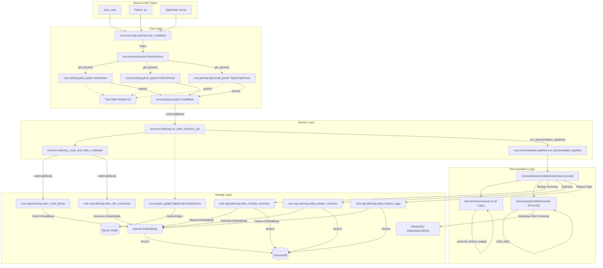
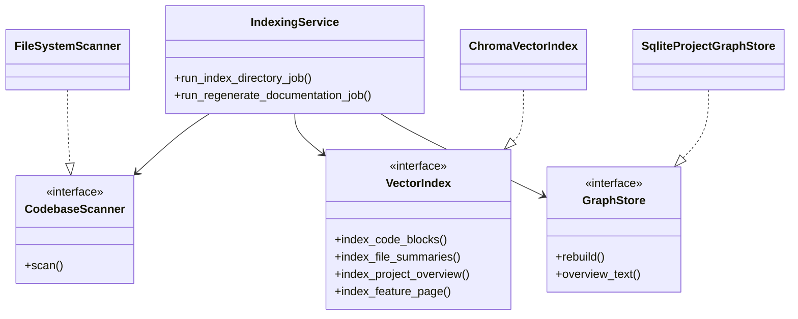
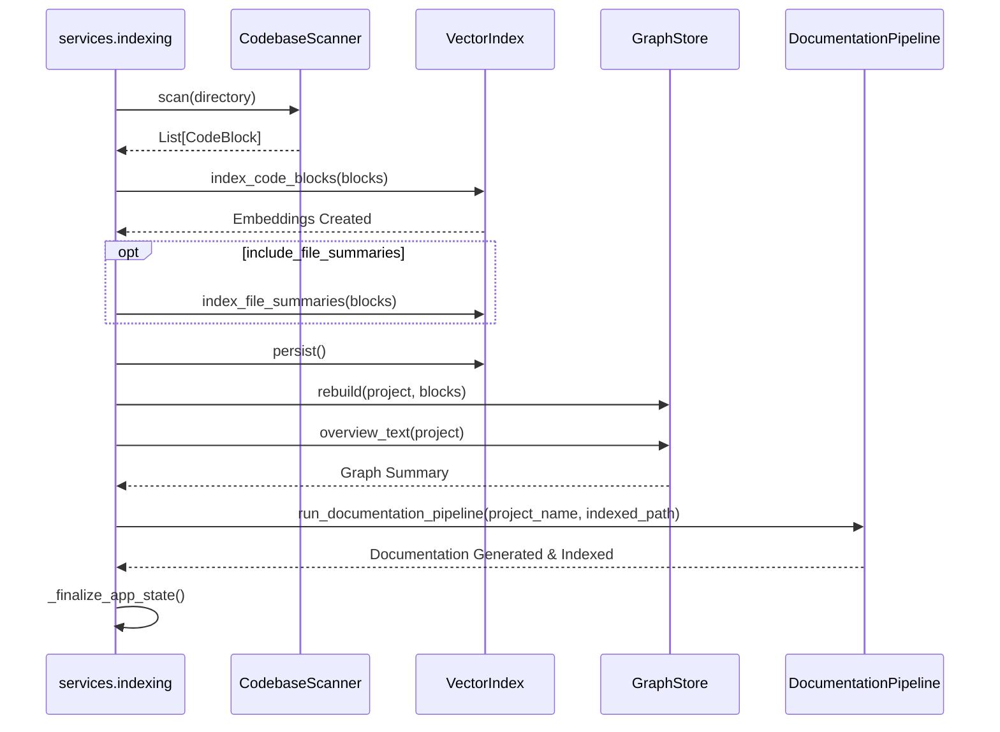
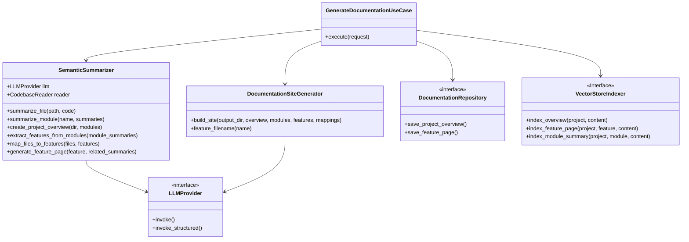
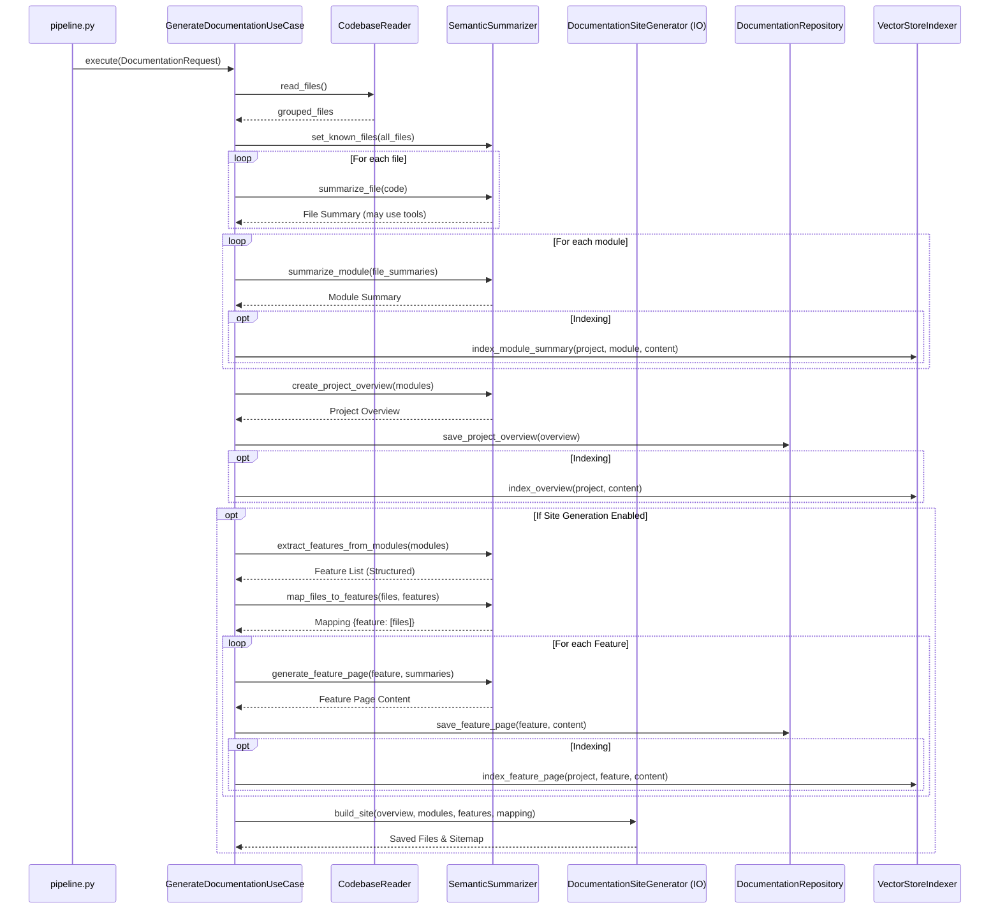
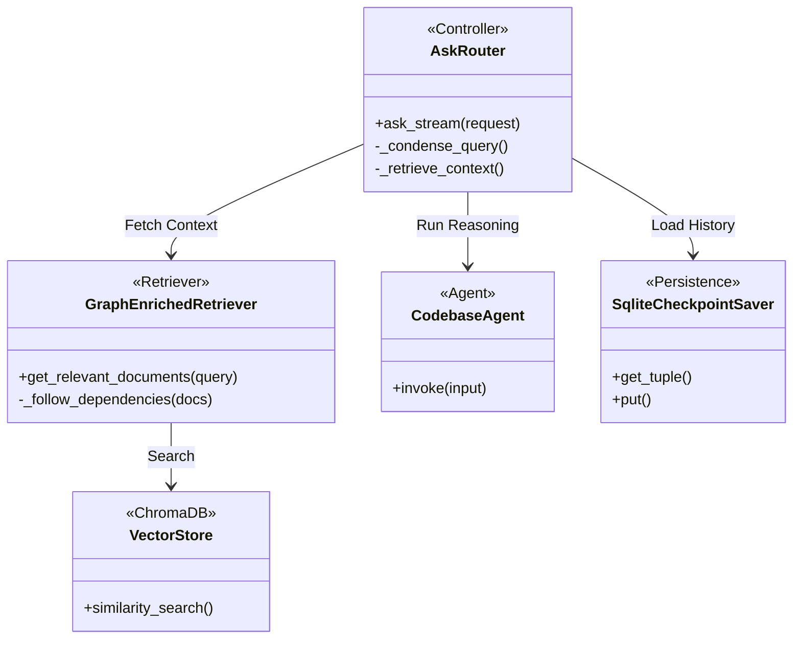
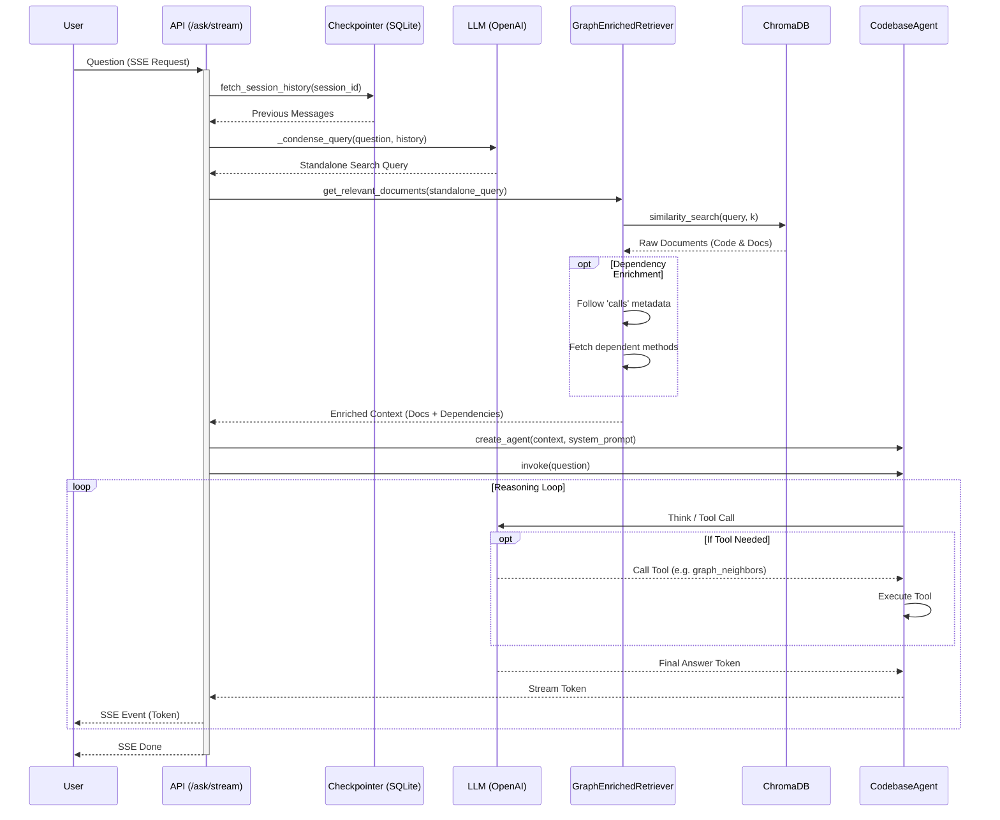

# Architecture d'Indexation Open DeepWiki

Ce document décrit le fonctionnement interne du système d'indexation multi-langage et de génération de documentation sémantique.

## Vue d'Ensemble

Le système est conçu pour analyser des bases de code hétérogènes (Java, Python, TypeScript), les transformer en vecteurs consultables pour le RAG (Retrieval Augmented Generation), et générer une documentation fonctionnelle progressive via LLM.

### Diagramme de Flux Général (Mermaid)

---

## Détail : Mécanisme de Scan / Indexation (Clean Architecture)

Ce processus utilise un service orchestrateur (`IndexingService`) coordonnant des composants découplés via des interfaces (Ports).

### Diagramme de Classes (Core Indexing)

### Flux d'Exécution (Indexation Complète)

---

## Détail : Génération de Documentation Markdown (Clean Architecture)

Ce processus a été refactorisé pour suivre les principes de la Clean Architecture. La génération est pilotée par un cas d'utilisation (`GenerateDocumentationUseCase`) et s'appuie sur le module `generation.py`.

### Diagramme de Classes (Composants)

### Flux d'Exécution (Pipeline de Documentation)

---

## Détail : Moteur de Recherche & RAG (Query)

Cette section décrit comment une requête utilisateur est traitée, enrichie par le contexte (RAG), et comment l'Agent répond.

### Diagramme de Classes (Query Pipeline)

### Flux d'Exécution (Requête RAG)

### Points Clés (Query)

- **Retrieval Hybride** : Le système interroge à la fois les blocs de code, les résumés de fichiers, le Project Overview, et les pages de documentation générées.
- **Enrichissement de Graphe** : `GraphEnrichedRetriever` utilise les métadonnées statiques (`calls`) pour injecter automatiquement le code des dépendances appelées, offrant un contexte plus complet au LLM sans qu'il ait à chercher manuellement.
- **Agent Codebase** : L'agent final dispose d'outils (`vector_search`, `project_graph_overview`) pour explorer davantage si le contexte initial RAG ne suffit pas.
