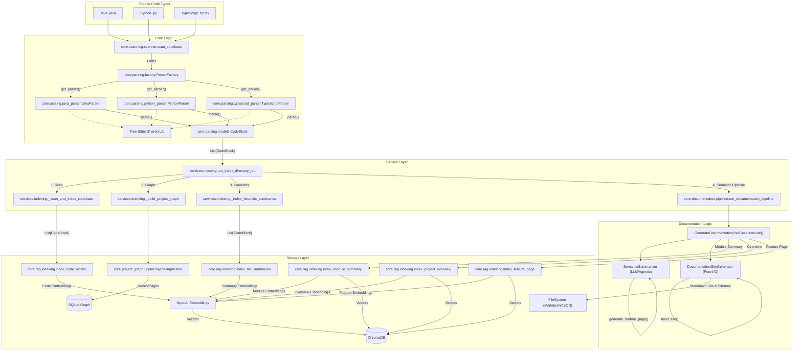
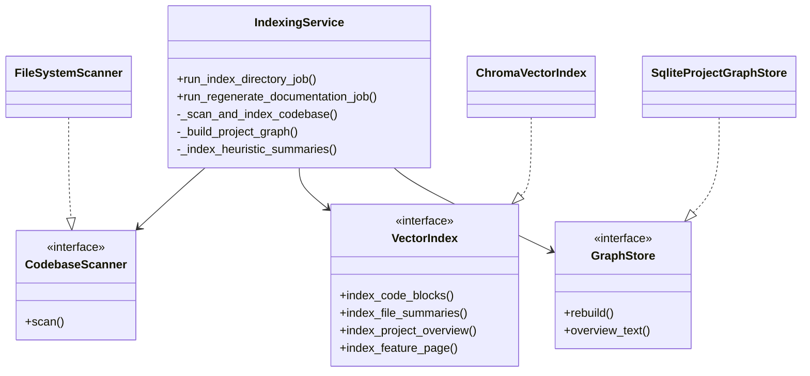
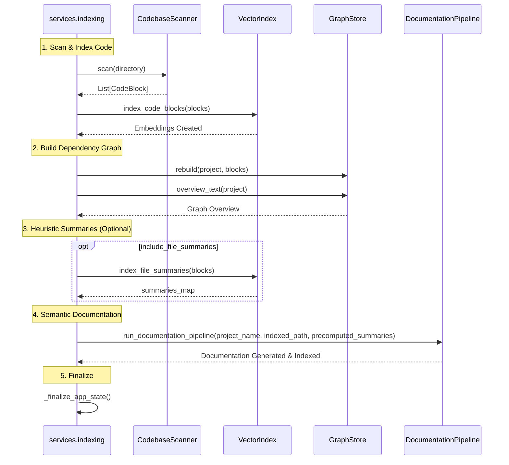
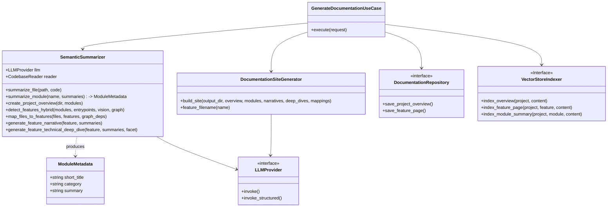
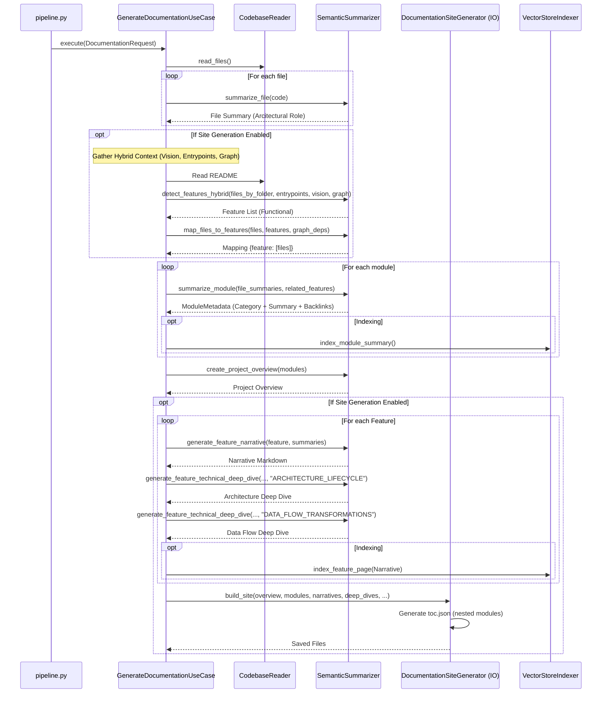
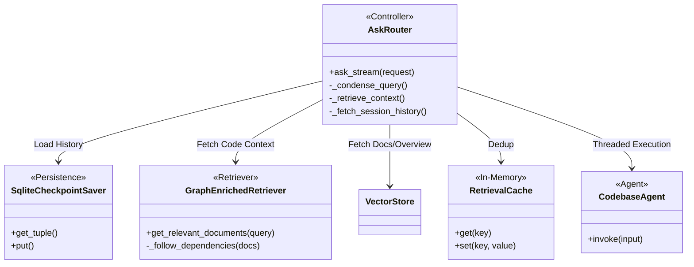
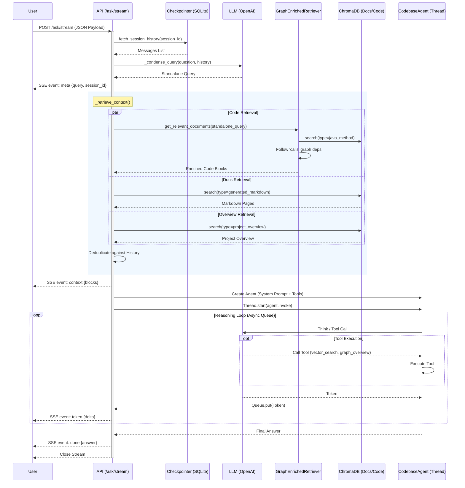

# Architecture d'Indexation Open DeepWiki

Ce document décrit le fonctionnement interne du système d'indexation multi-langage et de génération de documentation sémantique.

## Vue d'Ensemble

Le système est conçu pour analyser des bases de code hétérogènes (Java, Python, TypeScript), les transformer en vecteurs consultables pour le RAG (Retrieval Augmented Generation), et générer une documentation fonctionnelle progressive via LLM.

### Diagramme de Flux Général (Mermaid)

---

## Détail : Mécanisme de Scan / Indexation (Clean Architecture)

Ce processus utilise un service orchestrateur (`IndexingService`) coordonnant des composants découplés via des interfaces (Ports).

### Diagramme de Classes (Core Indexing)

### Flux d'Exécution (Indexation Complète - `run_index_directory_job`)

---

## Détail : Génération de Documentation Markdown (Clean Architecture)

Ce processus a été refactorisé pour suivre les principes de la Clean Architecture. La génération est pilotée par un cas d'utilisation (`GenerateDocumentationUseCase`) et s'appuie sur le module `generation.py`.

### Diagramme de Classes (Composants)

### Flux d'Exécution (Pipeline Documentaire Hybride)

## Philosophie de Documentation : "Fluidité & Deep Linking"

Pour éviter la séparation stricte entre "Récit Fonctionnel" et "Implémentation Technique", l'architecture suit une approche de **Tissage** :

1. **Feature comme Conteneur** : Les modules ne sont pas isolés dans une section annexe, mais présentés comme des "Détails d'Implémentation" directement sous la Feature qu'ils servent.
2. **Context Injection** : Lors de la génération du résumé d'un module, le LLM reçoit la liste des Features auxquelles ce module participe. Il génère alors un bloc `> [!NOTE]` explicite liant la technique au fonctionnel.
3. **Navigation Bidirectionnelle** : L'utilisateur peut naviguer de la Story vers le Module (via le TOC imbriqué et les liens contextuels) et du Module vers la Story (via les backlinks générés en début de fichier).

---

## Détail : Moteur de Recherche & RAG (Query)

Cette section décrit comment une requête utilisateur est traitée via le flux streaming SSE, enrichie par le contexte hybride, et exécutée par l'agent.

### Diagramme de Classes (Query Pipeline)

### Flux d'Exécution (Requête SSE & Récupération Hybride)

### Stratégie de Récupération "Hybride"

Le système ne se contente pas de chercher du code. La méthode `_retrieve_context` agrège trois sources distinctes pour donner une vision complète à l'agent :

1. **Code Enriched** (`GraphEnrichedRetriever`) :
    * Recherche vectorielle sur les chunks de code (`java_method`).
    * **Graph Walk** : Si un chunk contient des métadonnées `calls`, le retriever va automatiquement chercher le code des fonctions appelées (via `method_docs_map`) pour fournir le contexte d'exécution immédiat.
2. **Documentation Sémantique** :
    * Recherche vectorielle sur les fichiers Markdown générés (`generated_markdown`), permettant de récupérer les explications fonctionnelles ("Features") liées à la requête.
3. **Project Overview** :
    * Injection systématique (ou via recherche) du `project_overview` pour donner le contexte global de l'architecture.

Cette approche permet à l'agent de répondre aussi bien à des questions de bas niveau ("Comment fonctionne cette boucle ?") qu'à des questions de haut niveau ("Quelle est l'architecture de ce module ?").
